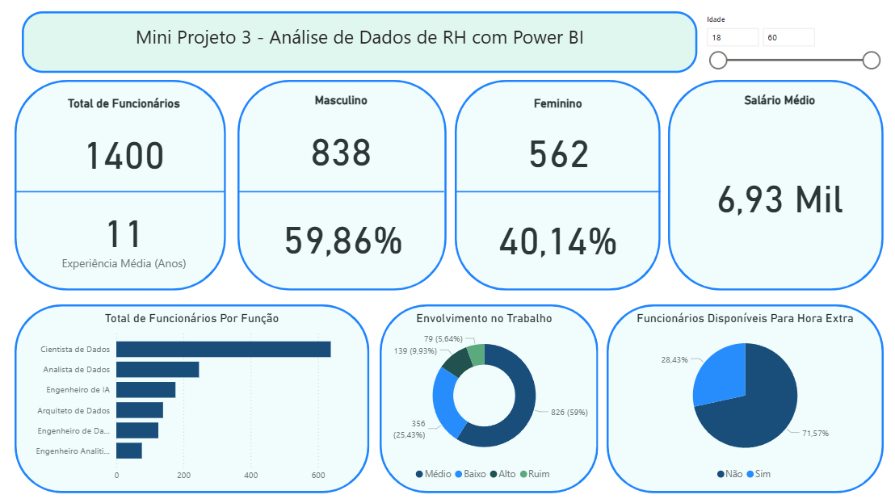
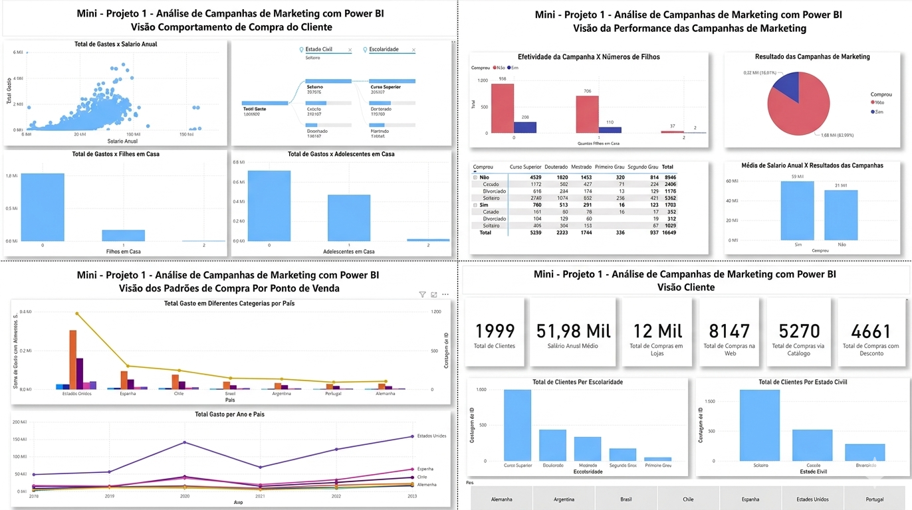
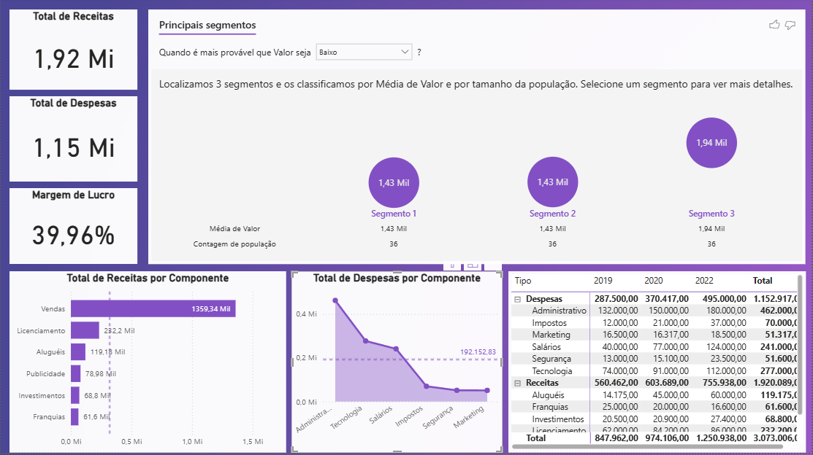
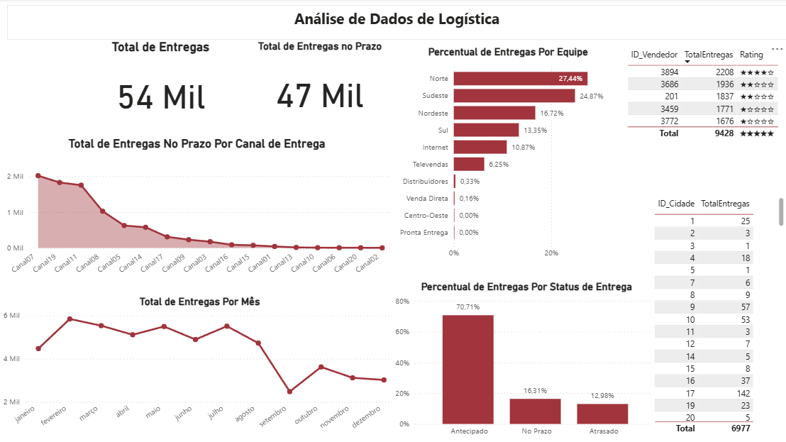

# 📊 Power BI para Business Intelligence e Data Science

Este repositório reúne meus estudos, anotações e projetos desenvolvidos ao longo do curso **Microsoft Power BI para Business Intelligence e Data Science**.

O objetivo foi ir além da ferramenta e entender como dados podem ser transformados em **informação útil para tomada de decisão**.

Aplicar conceitos de Business Intelligence na prática, trabalhando desde a **extração e tratamento de dados** até a **criação de dashboards interativos e análises de negócio**.

---

## 🧠 Conceitos Aprendidos

### 📌 Business Intelligence
- Uso de dados para análise descritiva (entender o que aconteceu)  
- Criação de relatórios e dashboards  
- Monitoramento de indicadores (KPIs)  
- Apoio à tomada de decisão  

### 📌 Modelagem de Dados
- Estruturação de dados para análise  
- Aplicação de **Star Schema**  
- Criação de relacionamentos entre tabelas  

### 📌 ETL (Extract, Transform, Load)
- Limpeza e transformação de dados com **Power Query (Linguagem M)**  
- Tratamento de valores ausentes e inconsistências  
- Integração de múltiplas fontes de dados  

### 📌 DAX (Data Analysis Expressions)
- Criação de medidas e colunas calculadas  
- Cálculos dinâmicos com contexto de filtro  
- Desenvolvimento de métricas como:
  L Total de vendas  
  L Ticket médio  
  L Crescimento ao longo do tempo  

### 📌 Análise de Negócio
- Aplicação de BI em diferentes áreas:
  L Vendas  
  L Marketing  
  L Finanças  
  L Recursos Humanos  
  L Logística  
- Definição e análise de KPIs  

---

## 📊 Dashboards Desenvolvidos

### 📈 Dashboard de RH
- Total Funcionários 
- Distribuição de Gênero   
- Salário Médio  
- Envolvimento no Trabalho 

---

### 📊 Dashboard de Marketing
- Perfil Demográfico e Socioeconômico do Cliente  
- Comportamento e Hábitos de Consumo  
- Performance e Eficácia das Campanhas 
- Análise Geográfica e Temporal de Vendas  

---

### 💰 Dashboard Financeiro
- Receita vs despesas  
- Margem de lucro  
- Receitas e Despesas por Componente 
- Indicadores e Segmentos financeiros  

---

### 🚚 Dashboard Logístico
- Total de Entregas  
- Entregas por Mês  
- Avaliação por Entregador  
- Eficiência operacional  

---

## 🛠️ Ferramentas Utilizadas

- Power BI (visualização e análise de dados)  
- Power Query (ETL e transformação de dados)  
- DAX (criação de métricas e análises avançadas)  
- Linguagem M (manipulação de dados no Power Query)  
- Excel / CSV (fontes de dados) 

---

## 📌 Próximos Passos

- Criar dashboards com dados reais  
- Integrar com SQL  
- Desenvolver projetos mais próximos de cenários de negócio  
- Evoluir para engenharia de dados  

---

## 💡 Considerações

Este projeto representa minha evolução no uso do Power BI e no entendimento de como transformar dados em insights.

Mais do que visualizações, o foco foi desenvolver uma visão analítica voltada para **negócio e tomada de decisão**.

---

## 📬 Contato

- [LinkedIn](https://www.linkedin.com/in/thiago-cbferreira/)  
- [GitHub](https://github.com/ThiagoCBF)
